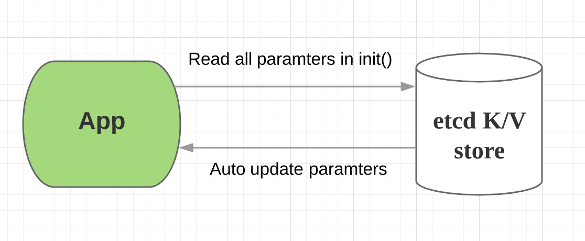

# echo

Echo is a configuration manager based etcd .



### Main functions

- Read paramters under special directory from etcd easily
- Automatic update configuration data in memory, while add, update or delete value under special etcd directory in etcd

### Getting started
```shell
$ go get -u github.com/Wang-Kai/echo
```

 ```golang
package misc

import (
	"log"

	"github.com/Wang-Kai/echo"
)

var AppConf echo.Config

const (
	etcdURI        = "http://127.0.0.1:2379"
	configParamDir = "my_config/"
)

// load config paramters
func init() {
	echoAgent, err := echo.New(etcdURI)
	if err != nil {
		log.Fatal(err)
	}

	config, err := echoAgent.GetConf(configParamDir)
	if err != nil {
		log.Fatal(err)
	}
	
	// export global configuration
	AppConf = config
}
  ```